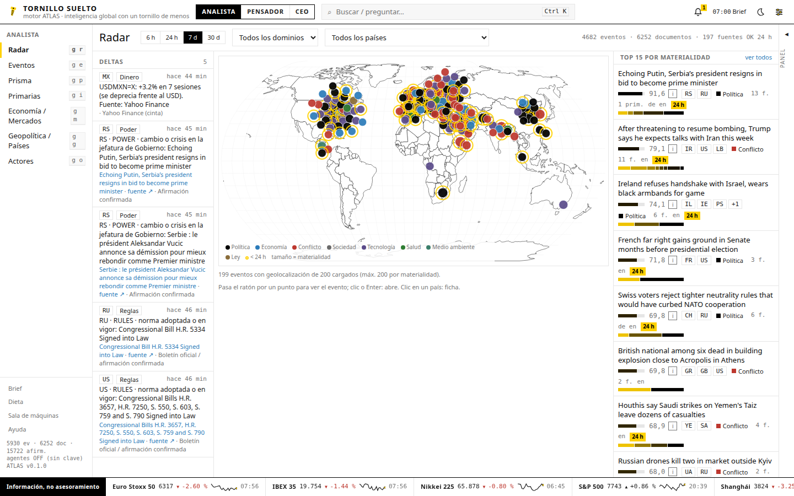

# TORNILLO SUELTO

> **Inteligencia global con un tornillo de menos.**
> Terminal personal de inteligencia (motor **ATLAS**) para el Dr. José Francisco Tornero-Aguilera:
> política, economía, mercados, geopolítica, ideas y decisiones, en una sola pantalla, local y privada.



## Qué hace hoy

| Modo | Módulo | Qué ves |
|---|---|---|
| ANALISTA | **RADAR** | Mapa mundial con los eventos del día por materialidad (no por viralidad), deltas de variables de estado con su fuente y los 15 eventos que importan. |
| | **EVENTOS** | Cada evento descompuesto en afirmaciones con cita literal, estado (confirmada / disputada / desmentida / sin verificar), nivel (HECHO / DATO / ACADÉMICO / OPINIÓN), fuentes por ecosistema, cronología de revisiones, contexto, análogos históricos y pronósticos. |
| | **PRISMA** | Matriz de cobertura ideología × región, índice de silencio (quién NO cuenta la historia) y vocabulario diferencial por ecosistema. |
| | **PRIMARIAS** | Flujo de documentos oficiales (BOE, BCE, Fed, Casa Blanca, ONU, OMS, BoE, BoJ, Bundesregierung…) y DIFF entre dos versiones o comunicados. |
| | **MERCADOS** | Cinta de índices, divisas, materias primas y tipos; qué descuentan los mercados de predicción; canales causales. Sin asesoramiento financiero. |
| | **PAÍSES / ACTORES** | Fichas por país con «¿Qué ha cambiado?», prensa local frente a extranjera; entidades con menciones fechadas y afirmaciones atribuidas. |
| PENSADOR | **ÁGORA** | Mapas argumentales (la RBU viene sembrada: Van Parijs, Atkinson, Hayek, Rawls y la evidencia empírica), genealogía de la libertad, lentes y tutor socrático. |
| | **ARCHIVO** | 81 casos históricos codificados (crisis de deuda, hiperinflaciones, sanciones, golpes, revoluciones, pandemias, referendos, altos el fuego, shocks) y búsqueda de análogos. |
| | **PRONÓSTICOS** | Ciclo completo: pregunta con criterio de resolución, tu probabilidad antes que la del sistema, mercado enlazado, resolución, Brier y calibración. |
| | **TALLER** | Notas con `[[enlaces]]` y retroenlaces, tarjetas de repaso espaciado, exportación Markdown con tu firma. |
| CEO | **MANDO** | Exposición de tus negocios por canal (regulatorio, fiscal, divisas, cadena de suministro, demanda…), radar regulatorio y diario de decisiones con pre-mortem. |
| | **BRIEF** | El brief de las 07:00 con cuotas por sección, hechos con cita, divergencia narrativa, primaria, por qué importa y el concepto del grado. |
| Transversal | **DIETA · SALA DE MÁQUINAS** | Diversidad de tu dieta informativa y puntos ciegos; salud de 300 fuentes, jobs, coste de LLM y presupuesto. |

Todo lo anterior funciona **sin clave de API**. Con `ANTHROPIC_API_KEY`, la mesa de agentes (extractor, editor jefe,
analistas, filósofo, tutor socrático, equipo rojo, superpronosticador) mejora cada pantalla y cada llamada queda
registrada con su coste. Y sí: **Tuerca**, la gata, pasea por la pantalla.

## Arrancar en tres comandos

```bash
make install     # crea .venv, instala backend (uv) y frontend (npm)
make seed        # fuentes, países, casos históricos, mapa argumental, plantillas de pronóstico
make up          # compila la web y levanta todo en http://127.0.0.1:8765
```

La primera ingesta arranca sola a los pocos segundos (o `make ingest` para forzarla). En 2-3 minutos el RADAR
tiene cientos de eventos reales de ~200 fuentes.

Opcional: copia `.env.example` a `.env` y añade `ANTHROPIC_API_KEY` para activar los agentes.

## Requisitos

Python ≥ 3.11 con [uv](https://docs.astral.sh/uv/), Node ≥ 20 y npm. Nada más: ni Docker, ni Postgres, ni Redis
(ADR-0001). Todo vive en `data/atlas.db` (SQLite).

## Estructura

```
tornillo-suelto/
├── services/core/atlas_core/   backend: FastAPI · conectores · motores · agentes · planificador · CLI
├── apps/web/                   frontend: React + TypeScript + Vite (estilo Hespérides, gata incluida)
├── config/                     fuentes.seed.yaml · feeds.yaml (199 verificados) · paises · perfil · models · budget
├── prompts/runtime/            contratos de los agentes (se cargan por nombre y versión)
├── docs/                       PLANTEAMIENTO.md · adr/ · spec/ (especificación original) · PROGRESS.md
├── brand/                      guía de estilo Hespérides, logos y fuentes Noto Sans
├── tests/                      pytest (motores, API, conectores)
└── data/                       base de datos y caché (fuera de git)
```

## Comandos

`make help` lista todo. Los más usados: `make ingest`, `make markets`, `make brief`, `make test`, `make lint`,
`make dev` (API con recarga + Vite en :5173). CLI: `.venv/bin/atlas --help`.

## Principios que el código respeta

1. **Cita o descarta**: ninguna afirmación llega a la pantalla sin `document_id` y cita literal verificada.
2. **Todo puntuado se explica**: materialidad, silencio y probabilidad exponen su desglose.
3. **Procedencia visible**: heurístico frente a modelo, titular de la fuente frente a título generado.
4. **Datos, no órdenes**: el contenido ingerido nunca se ejecuta como instrucción.
5. **Privacidad**: el perfil y los negocios no salen de tu máquina; al modelo solo va el fragmento mínimo.
6. **Presupuesto**: tope diario configurable; al 80% se pausan las tareas no críticas.
7. **Sin asesoramiento financiero**: nunca hay órdenes ni brókers.

Más detalle: `docs/PLANTEAMIENTO.md`, `docs/adr/` y `PROGRESS.md`. Capturas de cada pantalla en `docs/capturas/`
(`make screenshots` las regenera con la API levantada).
